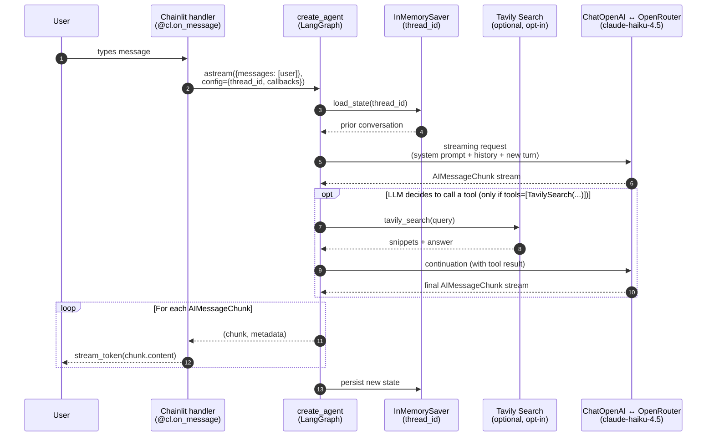

# Conversation flow

What happens between "user types a message" and "tokens render in the chat bubble." The optional Tavily branch (Block 4.5) is dashed; everything else is on the default path.

## Where each piece lives

- **Chainlit handlers** — `app/main.py` (`on_chat_start`, `on_message`, `on_feedback`, `set_starters`)
- **Agent factory** — `app/agent.py` (`build_agent`)
- **System prompt** — `app/prompts/tutor.py`
- **Tools factory** — `app/tools.py` (`build_tools`, returns `[]` until `TAVILY_API_KEY` is set and the optional grounding upgrade is wired in)
- **Chat model wiring** — `app/ai/client.py` (`get_openrouter_chat_model`)

## Why this shape

- **Per-session `thread_id`** (uuid4 generated in `on_chat_start`) — different browser tabs get isolated memory. ADR-005 covers the choice of `create_agent` + `InMemorySaver` over the legacy `RunnableWithMessageHistory`.
- **`stream_mode="messages"`** — yields `(BaseMessage, metadata)` per LLM token. Forwarded to `cl.Message.stream_token()` for the typewriter effect.
- **Tool branch is opt-in** — without `TAVILY_API_KEY`, `build_tools()` returns `[]` and the agent never enters the tool path. The system prompt's grounding rule (rule 9) is also conditional, so we never instruct the model to call a tool that doesn't exist.
- **`AsyncLangchainCallbackHandler`** (passed in `config["callbacks"]`) is what makes the LLM call appear as a Step in the Chainlit sidebar, with timing.
